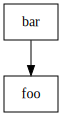
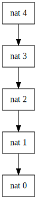
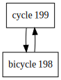
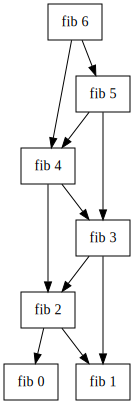

# Hippo language

The Hippo programming language is a simple language built around the concept of nodes.


## Usage
`pip install -r requirements.txt` (this install the lark parser dependency)

`./hippo.py fib.hippo`

## Nodes

A node is similar to a cell in a spreadsheet in that it can contain a value or expression and refer to other nodes. The word "node" is
used since, during evaluation, nodes are put into a dependency graph, and the dependency graph is evaluated in topological order to 
obtain values for all desired nodes.

For example, the code

```
foo = 10

bar = foo + 1
```

would result in the dependency graph



The program actually specifies node patterns rather than nodes. What this means is that we can specify a general pattern for a node,
indexed on one or more int values. This would be similar to specifying an equation for e.g. all cells in a spreadsheet column. A node
name may occur multiple times in a pattern definition, and the first instance of a pattern matching arguments is used to compute the node's value.

```
nat 0 = 1

nat n = 1 + [nat n-1]
```

explicitly specifies a value for `nat 0` and computes all other values of `nat n` recursively.



Since pattern matching greedily uses the first matching pattern, the code

```
nat n = 1 + [nat n-1]

nat 0 = 1
```

will never terminate, as the base case `nat 0` is never reached.

### Cycles
The above code never terminates due to infinite recursion. The interpreter is unable to prevent this as it is unable detect that a graph has infinite size.

However, in case of a cycle in the dependency graph, the interpreter will report an error.

For example, the program

```
cycle x = [bicycle x-1]

bicycle x = [cycle x+1]

RUN [cycle 199]
```

will terminate immediately as the interpreter is able to detect the cycle in the dependency graph:



## Running nodes

Node patterns are written as described above. However, for a node to actually be computed, it needs to either 

1. explicitly be requested to run, or 
2. run as a transitive dependency of another node that was explicitly requested.

For example, 

```
fib 0 = 0

fib 1 = 1

fib n = [fib n-1] + [fib n-2]

RUN [fib 100]
```

will compute the 100th Fibonacci number, as the `RUN` statement requests it, and will compute all preceding Fibonacci
numbers as transitive dependencies of `fib 100`. The dependency graph for `fib 6` is:




Nodes can also be mutually recursive, so the program above could also be written as:

```
fib 0 = 0

fib 1 = 1

a n = [fib n-1] + [fib n-2]

fib n = [a n]

RUN [fib 100]
```

### Memoization

As nodes are run, their values are memoized. This is similar to how a spreadsheet would run. One effect of this is that the `fib` program above will run in `O(n)` time rather than exponential time. Note that this is different from Haskell where memoization only occurs if the identical thunk (i.e. identical as in the same thunk in the interpreter's memory) is used for all references to a subproblem.

## Not implemented

### Easy

* The parser doesn't understand negative literals.
* Node references are wrapped in braces, which isn't really necessary.
* Detect when a node pattern is defined with differing numbers of arguments (e.g. `foo n` and `foo 1 0`)

### More difficult

Nested node references are allowed by the grammar but will cause an error in the interpreter. This means that the following program won't run:

```
a x = x
b x = 1

foo x = [a [b x]]

RUN [foo 1]
```

I could make nested references work by doing two things:

  * `find_references_no_nesting()` needs to be replaced with a function that returns the deepest nested reference that can't be immediately evaluated.
  * Loop over the graph (max # nests) times. Each time we're effectively decreasing the level of nesting by 1.
    - Call `run()` multiple times, and each time use the `result` map from the previous run, and 
    - ignore the exception when processing `('post', node_to_run, ...)` as a result of `EvalTransformer.eval` not finding an evaluated `NodeToRun` in its call to `_lookup()`
